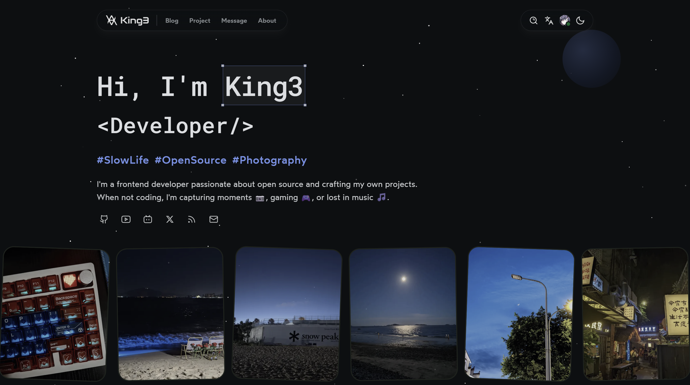

<h1 align="center">king3.me</h1>

<p align="center"><a href="./README.md">English</a></p>

<p align="center">我的个人官网项目</p>

<!--  -->

## 🛠️ 技术栈

| 层级     | 技术                                       |
| -------- | ------------------------------------------ |
| 框架     | Next.js 16, React 19, React Compiler       |
| 样式     | Tailwind CSS v4, CSS Modules, PostCSS      |
| UI 组件  | shadcn/ui (base-nova 风格), Lucide 图标    |
| 动画     | Framer Motion, @react-spring/web           |
| 数据库   | PostgreSQL (Neon)                          |
| ORM      | Prisma ORM                                 |
| 身份认证 | better-auth (GitHub + Google OAuth)        |
| 国际化   | i18next, react-i18next                     |
| MDX      | next-mdx-remote, rehype-pretty-code, shiki |
| 部署     | Vercel                                     |

## 📦 前置要求

- Node.js >= 20
- pnpm >= 9

## 🚀 快速开始

1. **克隆仓库**

   ```bash
   git clone https://github.com/coderking3/king3.me.git
   cd king3.me
   ```

2. **安装依赖**

   ```bash
   pnpm install
   ```

3. **配置环境变量**

   ```bash
   cp .env.example .env
   ```

   必需的变量：
   - `DATABASE_URL` / `DIRECT_URL` — PostgreSQL 连接字符串
   - `BETTER_AUTH_SECRET` — 使用 `openssl rand -base64 32` 生成
   - `BETTER_AUTH_URL` — 应用 URL（例如 `http://localhost:3060`）
   - `GITHUB_CLIENT_ID` / `GITHUB_CLIENT_SECRET` — GitHub OAuth 应用凭证
   - `GOOGLE_CLIENT_ID` / `GOOGLE_CLIENT_SECRET` — Google OAuth 应用凭证

4. **初始化数据库**

   ```bash
   pnpm db:generate   # 生成 Prisma Client
   pnpm db:push       # 将 schema 推送到数据库
   ```

5. **启动开发服务器**

   ```bash
   pnpm dev
   ```

   在浏览器中打开 [http://localhost:3060](http://localhost:3060)。

## 📄 许可证

代码采用 [MIT](./LICENSE) 许可，<br/>
文字和图片均采用 [CC BY-NC-SA 4.0](https://creativecommons.org/licenses/by-nc-sa/4.0/) 许可。
